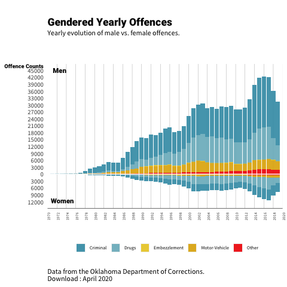
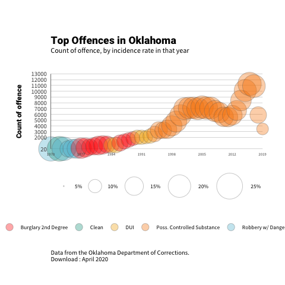

R Notebook
================

*This contains the scripts as well as introductory insights to my final capstone project as part of the curriculum for the Masters in Applied Economics at the University of San Francisco.*

*This section goes over my introduction. To go straight to the data cleaning script, please open Oklahoma.R above. The script is heavily annotated and designed to be shared with non-R users (Stata), so made to be as simple as possible*

**In Whose Interest : Private Prisons & Sentencing Lengths**

Prisons are ill-defined. Are they meant to rehabilitate? Are they meant to punish? Can both these purposes co-exist? These important questions have often been swept under the rug in favour of 'protecting the public' from criminals. This mindset has some serious negative externalities. The first, and most obvious, is economic. Housing, feeding, clothing, supervising and disciplining any human being is an onerous activity. The second is the cost of the thousands of lives which are siphoned into this system. By all accounts, the prison system disproportionately punishes African-Americans. This is not an artefact of differing rates of criminality, but is indeed by design. Undeniably, the American prison system is a direct legacy of slavery.

These two concerns crystallize in a specific segment of the correctional landscape : the private prison corporation.

The history of profit in American prisons is a long and complex one (Jewkes, 2007). These institutions continue to play an important role in modern times, making up roughly 23% of all state and federal institutions (Kirchoff, 2010). Despite this, they have received considerably little empirical scholarship. This is surprising. Being for-profit institutions, private prisons financially benefit from high incarceration rates. On the other hand, wider social utility is maximised when incarceration is as low as possible, as every marginal inmate incurs a non-trivial cost on the public purse. This introduces contesting incentives into the prison system.

This essay aims to examine these differing incentives through the specific lens of sentencing lenghts. Although sentencing lengths are often not served in their entirety, they play a critical role in keeping prison population high. Indeed, research indicates that decreasing sentencing by a month would lead to a reduction of incarceration by up to 50,000 inmates (Kirchoff, 2010). To do so, Department of Corrections (henceforth : DOC) data from both Oklahoma - whose prison systems heavily depends on private prisons - and Missouri, a neighbouring state which does not, will be used. Both are publicly available, at \[<http://doc.ok.gov/odoc-public-inmate-data>\] and \[<https://doc.mo.gov/media-center/sunshine-law#datafile>\].

Stated explicitly, this research aims to see if the introduction of private prisons led to an increase in average time sentenced per inmate. A "difference-in-difference" regression - a popular causal inference method in econometric research - will be used to do so. Given correct specification (notably, the parallel trends assumption, careful adjustments of standard errors and domain knowledge regarding treatment), results from the regression can be used to estimate the effect of private prisons on sentencing in Oklahoma.

*Below I quickly outline my data gathering and cleaning process*

**Data Cleaning**

The Oklahoma data is uploaded as a series of fixed-width files. These were opened given their stipulated lengths. Four datasets were provided :one with personal information for each inmate ( as per their DOCNum), one with the associated sentencing details for each DOCNum, as well as a list of Oklahoma statutes needed to understand the nature of their crimes and aliases for each inmate. Overall, the data was rich in details but sadly suffered from some grave inconsistencies (some inmates sentenced before the date of birth etc.)

As I am still in the process of finalising the analysis for my project, here I show only the outputs from two graphs made from the Oklahoma data. These were made to better understand the evolution of offences and inmates in Oklahoma, and strenghten domain knowledge for the subsequent statistical analysis.

``` r
library('Rcpp')
library('haven') 
```

    ## Warning: package 'haven' was built under R version 3.5.2

``` r
library('dplyr') 
```

    ## Warning: package 'dplyr' was built under R version 3.5.2

    ## 
    ## Attaching package: 'dplyr'

    ## The following objects are masked from 'package:stats':
    ## 
    ##     filter, lag

    ## The following objects are masked from 'package:base':
    ## 
    ##     intersect, setdiff, setequal, union

``` r
library('AER')   
```

    ## Warning: package 'AER' was built under R version 3.5.2

    ## Loading required package: car

    ## Warning: package 'car' was built under R version 3.5.2

    ## Loading required package: carData

    ## 
    ## Attaching package: 'car'

    ## The following object is masked from 'package:dplyr':
    ## 
    ##     recode

    ## Loading required package: lmtest

    ## Warning: package 'lmtest' was built under R version 3.5.2

    ## Loading required package: zoo

    ## Warning: package 'zoo' was built under R version 3.5.2

    ## 
    ## Attaching package: 'zoo'

    ## The following objects are masked from 'package:base':
    ## 
    ##     as.Date, as.Date.numeric

    ## Loading required package: sandwich

    ## Warning: package 'sandwich' was built under R version 3.5.2

    ## Loading required package: survival

``` r
library('plm')
```

    ## Warning: package 'plm' was built under R version 3.5.2

    ## 
    ## Attaching package: 'plm'

    ## The following objects are masked from 'package:dplyr':
    ## 
    ##     between, lag, lead

``` r
library('stargazer')
```

    ## 
    ## Please cite as:

    ##  Hlavac, Marek (2018). stargazer: Well-Formatted Regression and Summary Statistics Tables.

    ##  R package version 5.2.2. https://CRAN.R-project.org/package=stargazer

``` r
library('ggplot2')
```

    ## Warning: package 'ggplot2' was built under R version 3.5.2

``` r
library('forecast')
```

    ## Warning: package 'forecast' was built under R version 3.5.2

``` r
library('tseries')
```

    ## Warning: package 'tseries' was built under R version 3.5.2

``` r
library('zoo')
library('naniar') 
```

    ## Warning: package 'naniar' was built under R version 3.5.2

``` r
library('lubridate')
```

    ## 
    ## Attaching package: 'lubridate'

    ## The following object is masked from 'package:base':
    ## 
    ##     date

``` r
library('stringr')
```

    ## Warning: package 'stringr' was built under R version 3.5.2

``` r
library('rvest')
```

    ## Loading required package: xml2

``` r
library('xml2')
library('tidyr')
```

    ## Warning: package 'tidyr' was built under R version 3.5.2

``` r
library('extrafont')
```

    ## Registering fonts with R

``` r
library('lemon')
```

    ## 
    ## Attaching package: 'lemon'

    ## The following objects are masked from 'package:ggplot2':
    ## 
    ##     CoordCartesian, element_render

``` r
library('ggrepel')
```

    ## Warning: package 'ggrepel' was built under R version 3.5.2

``` r
library('gridExtra')
```

    ## 
    ## Attaching package: 'gridExtra'

    ## The following object is masked from 'package:dplyr':
    ## 
    ##     combine

``` r
library('grid')
library('ggplot2')
library('lattice')
library('cowplot')
```

    ## Warning: package 'cowplot' was built under R version 3.5.2

    ## 
    ## ********************************************************

    ## Note: As of version 1.0.0, cowplot does not change the

    ##   default ggplot2 theme anymore. To recover the previous

    ##   behavior, execute:
    ##   theme_set(theme_cowplot())

    ## ********************************************************

    ## 
    ## Attaching package: 'cowplot'

    ## The following object is masked from 'package:lubridate':
    ## 
    ##     stamp

``` r
library('wesanderson')

explore <- read.csv("~/Desktop/portfolio/oklahoma/scripts/oklahoma_clean.csv")
explore$year <- lubridate::ymd(explore$year, truncated = 2L)
```

*Figure 1*

This figure was made out of curiosity for the Oklahoma prison system which has held record incarceration rates for several decades. Notably, the state houses an unusually high amount of female inmates. I wanted to understand how men and women offended, and how this has changed over the years.

``` r
# Data Wrangle
gender_crime <- explore %>% 
  group_by(year, sex, agg_desc) %>% 
  count() %>% 
  group_by(sex,year) %>% 
  mutate( tot_off = sum(n)) %>% 
  mutate( bar = ifelse(sex == "F", -1*n, n)) 

#set date limits
min <- as.Date("1970-01-01")
max <- as.Date("2020-01-01")


#set date limits
min1 <- as.Date("1970-01-01")
max1 <- as.Date("2019-01-01")


plot1 <- ggplot(gender_crime, aes(fill=agg_desc, y=bar, x=year)) + 
  geom_bar(position="stack", stat="identity", alpha =0.9) +
  scale_fill_manual(values= wes_palette(name = "Zissou1"), aesthetics = "fill") +
  scale_x_date(expand =c(0,0), limits = c(min, max), date_labels="%Y", date_breaks  ="2 years") +
  scale_y_continuous(limits = c(-12000, 45000), 
                     breaks = c(-12000, -9000, -6000, -3000, seq(0,45000, 3000)),
                     labels = c(12000, 9000, 6000, 3000, seq(0,45000, 3000))) +
  labs(title = "Gendered Yearly Offences",
       subtitle ="Yearly evolution of male vs. female offences.\n\n\n",
       y= "Offence Counts",
       x= "",
       caption = 'Data from the Oklahoma Department of Corrections.\nDownload : April 2020') +
  annotate("text", y = -11500, x = as.Date("1973-03-01"), label = "Women", family="Roboto Black", size = 3) +
  annotate("text", y = 45000, x = as.Date("1972-08-01"), label = "Men", family="Roboto Black", size = 3) +
  theme(text = element_text(family = 'Source Sans Pro'),
        #plot text
        plot.title = element_text(margin = margin(t = 20), face="bold", vjust = 2, family = 'Roboto Black'),
        plot.subtitle = element_text(size = 9, family ="Source Sans Pro"),
        plot.caption = element_text(margin = margin(t = 15), hjust = 0, size =9),
        #asix
        axis.title.y = element_text(angle = 0 , size = 7, margin = margin(t = 0, r = -20 , b = 0, l = 0), family ="Roboto Black"),
        axis.text.y = element_text(face="bold", size = 8),
        axis.text.x = element_text(size =5, angle = 90), axis.line.x = element_line(colour = "grey40", size = 0.3), 
        axis.ticks = element_blank(),
        #legend
        legend.title = element_blank(), legend.text = element_text(size = 6),
        legend.key.size = unit(.4, 'cm'), legend.position = "bottom", 
        legend.background = element_rect(fill=alpha(0.4)),
        #panels
        panel.background = element_rect(fill = NA),
        panel.grid.major = element_line(colour = "grey50", size = 0.1),
        panel.grid.major.y = element_blank())+
  geom_hline(yintercept = 0, colour="white", size =0.5)

plot1
```

    ## Warning: Removed 159 rows containing missing values (position_stack).

    ## Warning: Removed 14 rows containing missing values (geom_bar).



This led me to thinking about which crimes were the most popular per year. I thus created this graph, which looks at what offence was the most 'popular' per year, and the percentage it played relative to total offence for that year.

``` r
# Data wrangle
topcrime_year <- explore %>%
  group_by(year) %>% 
  count(statute,desc) %>% 
  mutate(tot_offence = sum(n), perc = (n/tot_offence)*100) %>% 
  slice(which.max(n))

# clean up decription names for plot
unique(topcrime_year$desc)
```

    ##  [1] Poss Of Controlled Substance            
    ##  [2] Rec/Poss/Conc Stolen Property           
    ##  [3] Burglary - Second Degree                
    ##  [4] Embezzlement                            
    ##  [5] Con/Felons Prohib/Carry Firearms        
    ##  [6] Parent Consent To Juvenile Pornography  
    ##  [7] Aggravated Assault And Battery          
    ##  [8] Lewd Or Indecent Proposals/Acts To Child
    ##  [9] Computer Fraud                          
    ## [10] Carrying Weapon/Drugs/Alcohol Into Jail 
    ## [11] Murder First Degree                     
    ## [12] Rape - First Degree                     
    ## [13] Dist Of Cds/Poss W/Intent               
    ## [14] Assault With Intent To Kill             
    ## [15] Personal Inj Accident While Dui         
    ## [16] Obtaining Prop Or Sign Under False Pret 
    ## [17] Forgery 2nd - Notes, Checks, Bills, Draf
    ## [18] Burglary - First Degree                 
    ## [19] Uttering Forged Instruments             
    ## [20] Robbery Or Attempted W/Dangerous Weapon 
    ## [21] Dui - Liquor Or Drugs/Apcv              
    ## 867 Levels: 2 Or More Bogus Checks Together Over $50 ...

``` r
topcrime_year$clean_desc <- "Clean"
topcrime_year$clean_desc  <- ifelse(grepl("Dui", topcrime_year$desc), "DUI", topcrime_year$clean_desc)
topcrime_year$clean_desc  <- ifelse(grepl("Robbery", topcrime_year$desc), "Robbery w/ Dangerous Weapon", topcrime_year$clean_desc)
topcrime_year$clean_desc  <- ifelse(grepl("Burglary", topcrime_year$desc), "Burglary 2nd Degree", topcrime_year$clean_desc)
topcrime_year$clean_desc  <- ifelse(grepl("Dist", topcrime_year$desc), "Distri. Controlled Substance", topcrime_year$clean_desc)
topcrime_year$clean_desc  <- ifelse(grepl("Poss", topcrime_year$desc), "Poss. Controlled Substance", topcrime_year$clean_desc)


#plot 2
plot2 <- ggplot(data = topcrime_year, aes(x=year, y=n, size=perc, fill=clean_desc)) +
  geom_point(alpha=0.35, shape =21, color ="grey40") + 
  guides(fill = guide_legend(override.aes = list(size = 4))) +
  scale_size(range = c(.1, 15), limits = c(5,25), labels =c("5%", "10%","15%","20%","25%")) +
  scale_fill_manual(values= wes_palette(name = "Darjeeling1"), aesthetics = "fill") +
  scale_x_date(expand = c(0, 0), limits=c(min1,max1), date_labels="%Y", date_breaks  ="7 years") +
  scale_y_continuous(expand = c(0, 0), limits = c(20, 13000), breaks = c(20, seq(2000, 13000, 1000)), labels = c(20, seq(2000, 13000, 1000))) +
  coord_cartesian(clip = "off") +
  labs(y = 'Count of offence',
       title = 'Top Offences in Oklahoma', 
       subtitle = 'Count of offence, by incidence rate in that year\n\n', 
       caption = 'Data from the Oklahoma Department of Corrections. \nDownload : April 2020') +
  theme(text = element_text(family = 'Source Sans Pro'),
        #plot text
        plot.title = element_text(margin = margin(t = 20), face="bold", vjust = 2, family = 'Roboto Black'),
        plot.subtitle = element_text(size = 9,face="bold", family ="Source Sans Pro"),
        plot.caption = element_text(margin = margin(t = 15), hjust = 0, size =8),
        #asix
        axis.title.y = element_text(size = 9,family ="Roboto Black", angle =90, vjust = 5),
        axis.title.x = element_blank(),
        axis.text.y = element_text(face="bold", size = 8, angle = 0),
        axis.text.x = element_text(size =5),
        axis.line.x = element_blank(), axis.ticks.x = element_blank(),
        axis.line.y = element_line(colour="grey40", size = 0.3), axis.ticks.y = element_blank(),
        #legend
        legend.title = element_blank(), legend.text = element_text(size = 7),
        legend.key = element_blank(), legend.position = "bottom", legend.box="vertical", 
        legend.background = element_rect(colour ="white", fill=alpha(0.8)),
        #panels
        panel.background = element_rect(fill = NA),
        panel.grid.major = element_line(colour = "grey50", size = 0.1),
        panel.grid.major.x = element_blank(),
        plot.margin = unit(c(1,1,1,1), "cm"))

plot2
```

    ## Warning: Removed 50 rows containing missing values (geom_point).



Two things emerged from the following graph.

1.  The origin of the explosion in US penal population is still contested. A widely circulated narrative is this began due to increasignly harsh crackdowns on drug offences during the 'War on Drugs' era. Several prominent intellectuals have championed this idea, most prominently Angela Davis in her book " Are prisons obsolete?". However, others have proposed that this is not the case. Notably, the book "Locked In: The True Causes of Mass Incarceration and How to Achieve Real Reform" by Fordham University criminal justice expert John Pfaff suggests that mass increases in penal population were due to an increase in violent offences. *Want to add : look at offence per inmate & see if corr between violent offence and drug offence*

2.  Although offence counts increased dramatically over the years, the ratio held of top offence:all offence stayed *relatively* constant. This seems to suggest that the diversity of crime has remained more or less the same over the years. This to me perhaps suggests that -behaviourally- crime has stayed the same, but what people are being arrested for over time changes. *Need to think more about this*

**Econometric Analysis**

Due to some data difficulties, this section is being reworked. Results added shortly (latest May 7th.)
